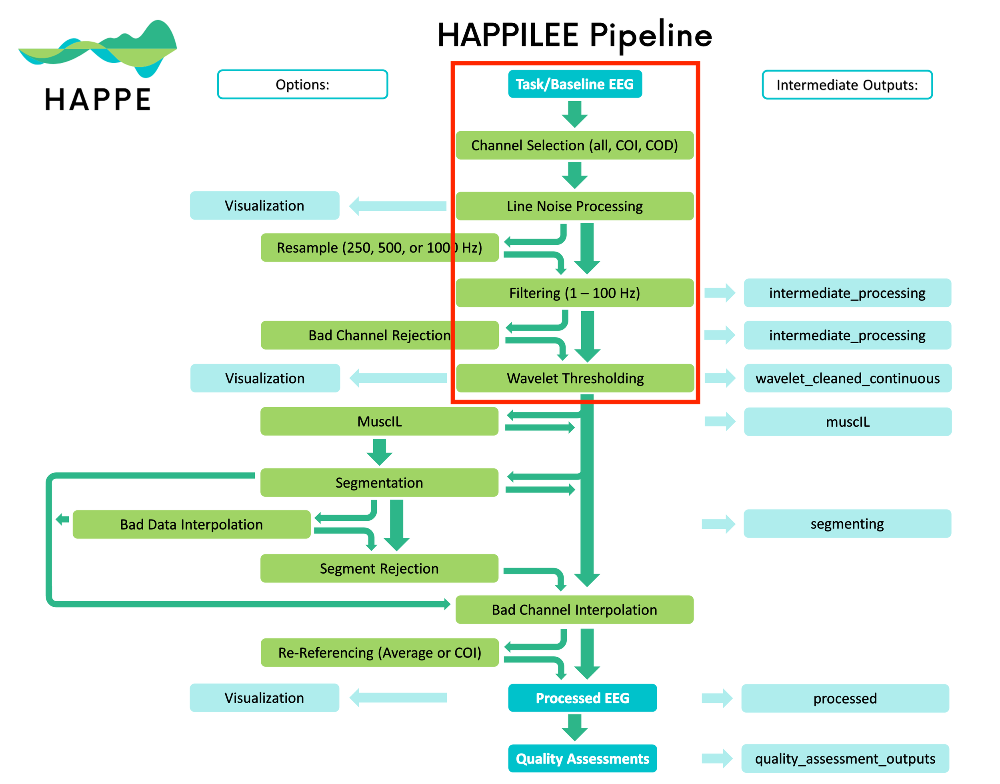

This is an implementation of the [HAPPILEE pipeline](https://www.plasticityinneurodevelopmentlab.com/happilee-lowdensity-eeg) for the [Explore system](https://github.com/Mentalab-hub/explorepy) from Mentalab.

HAPPILEE pipeline is applied to EEG data recorded by the Mentalab Explore Pro device in `happilee.py` and `happilee.ipynb`. `happilee.py` is the main script to apply HAPPILEE to a EXG dataset recorded by the Explore system. `happilee.ipynb` is a notebook to demonstrate and track steps of the HAPPILEE pipeline to a dataset recorded by the Explore system. 

A realtime example is available in `acquisition_example.py`.
Further tests and trials on different artifacts are available in `testing.ipynb`.

Noise removal is applied in real time to the data stream from the Explore device in `acquisition_example.py`.


[Figure Source](https://www.plasticityinneurodevelopmentlab.com/happilee-lowdensity-eeg)

*Steps of the pipeline included in our implementation are marked in a red rectange in the figure above.*


## Steps of the HAPPILEE pipeline covered in this implementation:
1. **Channel Selection**  
2. **Line Noise Processing**  
3. **Filtering**  
4. **Wavelet Thresholding**

These steps and evaluation results covered in the [evaluation.md](evaluation.md) file.

## Installation and Setup

To use HAPPILEE with your Explore device, follow these steps:

1. **Install Requirements**

   Ensure you have Python installed on your system. You can check this by running:

   ```bash
   python --version
   ```

   If Python is not installed, download and install it from the [official Python website](https://www.python.org/downloads/).

   Next, install the required Python packages using `pip`:

   ```bash
   pip install -r requirements.txt
   ```

2. **Run the Script**

   You can run the pipeline online or offline. Use the following commands:

   **Offline Mode**

   ```bash
   python happilee.py
   ```

   The script will prompt for the following inputs:
   - **File Type**: Select the file type to load (.csv or .edf).  
     Example input: `1`
   - **File Path**: Enter the path to the file, including the file name.  
     Example input: `ExG_data/offline_exp_ExG-30s.csv`
   - **Channel Names**: Input the channel names recorded (e.g., Fp1, Fp2, O1, etc.).  
     Example input: `POz`, `Oz`, `O1`, `O2`
   - **Line Frequency**: Input the line frequency.  
     Example input: `50`

   **Online Mode**

    Online mode example outputs a csv file (with the name `filtered_exg_data.csv`) containing the results of the HAPPILEE pipeline applied to the data stream from the Explore device.

   ```bash
   python acquisition_example.py --name <device_name>
   ```

   Replace `<device_name>` with the appropriate device name if necessary.

## Troubleshooting

- Ensure all dependencies are installed correctly.
- Verify the file paths and names are correct.
- On macOS when running in online mode, you might encounter permission issues, so try running the scripts with sudo privileges.

For more detailed information, please contact support.

