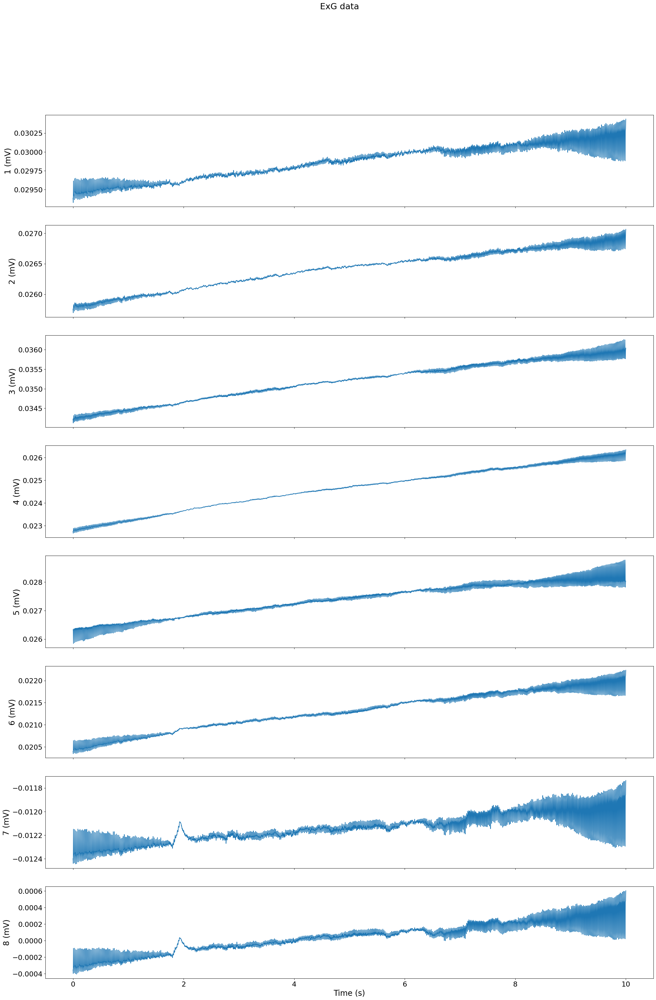

# Mentalab HAPPILEE Implementation Result Evaluation #

In this part, we evaluate the results of the HAPPILEE implementation step by step on a custom exg dataset recorded by the Mentalab Explore system.

## 1- Raw data ##
Evaluation run on a custom exg dataset which is available here: [demo_exg.csv](ExG_data/demo/demo_exg.csv)

Visualization of the raw data:

## 2- Notch Filtered data ##
First, we applied a notch filter at 50 Hz. Resulting csv file is available here: [out_ExG_ln_rm.csv](ExG_data/demo/out_ExG_ln_rm.csv)
Visualization of the filtered data:

## 3- high and low pass filtered data ##
We applied a low-pass filter at 30 Hz and a high-pass filter at 1 Hz.
Resulting csv file for low-pass filtered data is available here: [out_ExG_lpf.csv](ExG_data/demo/out_ExG_lpf.csv)
Resulting csv file for high-pass filtered data is available here: [out_ExG_hpf.csv](ExG_data/demo/out_ExG_hpf.csv)

## 4- Wavelet Thresholding ##
Finally, we applied a wavelet thresholding.
Visualization of the filtered data:

Resulting csv file after wavelet thrsholding is available here: [out_ExG_wav_thd.csv](ExG_data/demo/out_ExG_wav_thd.csv)
Visualization of the filtered data:

5- Results

A 50 Hz notch filter successfully reduced line noise, improving overall signal clarity. The combination of a 1 Hz high-pass and a 30 Hz low-pass filter further removed baseline drifts and high-frequency artifacts. Wavelet thresholding was then applied to eliminate remaining transient artifacts and enhance the overall signal quality, ultimately yielding a clean dataset well-suited for downstream analyses. The entire pipeline was successfully implemented in our setup, demonstrating its effectiveness for optimized ExG signal pre-processing.

