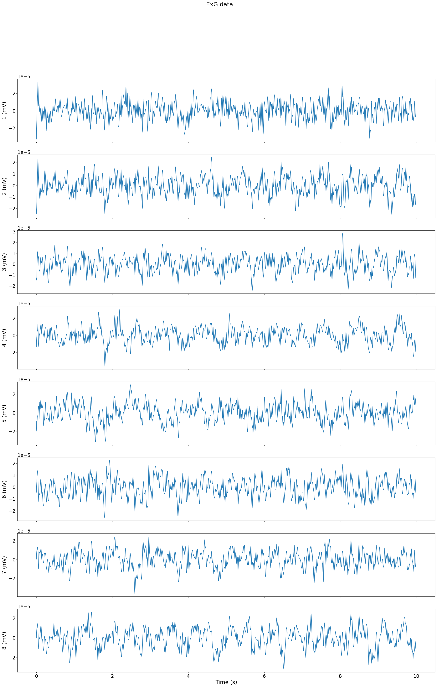

# Mentalab HAPPILEE Implementation Result Evaluation #

In this part, we evaluate the results of the HAPPILEE implementation step by step on a custom exg dataset recorded by the Mentalab Explore system.

## 1- Raw data ##
Evaluation run on a custom exg dataset which is available here: [demo_exg.csv](ExG_data/demo/demo_exg.csv)

Visualization of the raw data:

## 2- Notch Filtered data ##
First, we applied a notch filter at 50 Hz. Resulting csv file is available here: [out_ExG_ln_rm.csv](ExG_data/demo/out_ExG_ln_rm.csv)

Visualization of the filtered data:

## 3- high and low pass filtered data ##
We applied a low-pass filter at 30 Hz and a high-pass filter at 1 Hz.

Resulting csv file for low-pass filtered data is available here: [out_ExG_lpf.csv](ExG_data/demo/out_ExG_lpf.csv)

Resulting csv file for high-pass filtered data is available here: [out_ExG_hpf.csv](ExG_data/demo/out_ExG_hpf.csv)

## 4- Wavelet Thresholding ##
Finally, we applied a wavelet thresholding.

Visualization of the filtered data:

Resulting csv file after wavelet thrsholding is available here: [out_ExG_wav_thd.csv](ExG_data/demo/out_ExG_wav_thd.csv)

Visualization of the filtered data:

## 5- Comparison
We ran the Happilee pipeline in Matlab and compared the resulting plots with our python implementation.

Resulting edf file is available here: [demo-matlab-output.edf](ExG_data/demo/demo-matlab-output.edf)

Here is the resulting plot:

